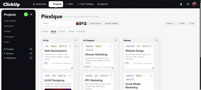

# 🧩 React Kanban Dashboard

<p align="center"> <b>Interactive, responsive Kanban dashboard with dynamic card resizing & drag-and-drop</b> </p> <p align="center"> <a href="https://dashboard-ui-virid-three.vercel.app/">  </a> <a href="https://github.com/akankshapatil2015/dashboard-ui">  </a>    </p>

---

🎥 Demo Preview

<p align="center"> </p>

---

## 🔗 Live Demo
👉 https://dashboard-ui-virid-three.vercel.app/

## 📂 GitHub Repo
👉 https://github.com/akankshapatil2015/dashboard-ui

---

## ✨ Features

- 📊 **Kanban Board Layout**
  - Multiple columns with structured task grouping
  - Clean and modern UI inspired by real productivity tools

- 📦 **Dynamic Card Resizing**
  - Supports both width & height adjustments
  - Enforced min/max constraints
  - Smooth animated transitions

- 📐 Fully Responsive Layout
   - 3-column → 2-column → 1-column adaptive grid
   - Mobile-friendly behavior
   - Resize controls disabled on smaller devices

- 🎯 **Interactive UI Elements**
  - Filter, Sort, and View controls (UI level)
  - Avatar groups and status indicators
  - Tabs navigation

- ⚡ **Performance & UX Enhancements**
  - Smooth resize animations
  - Optimized rendering
  - Mobile-friendly interactions (resize disabled on small screens)

- 🔄 **Drag & Drop (Advanced)**
  - Drag cards across columns
  - Drop into empty columns
  - Active column highlight during drag
  - Custom drag preview overlay

---

## 🚀 Performance Optimizations

- 🔹 **Memoization**
   - Used React.memo to prevent unnecessary re-renders of cards
     
- 🔹 **Avoiding Re-renders**
   - Component isolation (Board → Column → Card)
   - Only affected components update on state change
     
- 🔹 **Efficient State Updates**
   - Immutable updates for columns/cards
   - Minimal re-render scope during drag & resize
     
- 🔹 **Optimized UX**
   - Conditional rendering for overlays
   - Disabled heavy interactions on mobile

---

## 🛠️ Tech Stack

- **React.js**
- **JavaScript (ES6+)**
- **CSS3 (Flexbox + Grid + Media Queries)**
- **React Icons**
- **Vercel (Deployment)**

---

## 🧠 Key Implementation Details

### 🔹 Card Resizing Logic
- Managed using React `useState`
- Controlled width & height with min/max constraints
- Buttons disabled at limits to prevent overflow

###🔹 Drag & Drop System
- Built using @dnd-kit
- Handles:
   - Cross-column movement
   - Empty column drop
   - Reordering within column

### 🔹 Responsive Design
- CSS Grid with adaptive breakpoints
- Mobile-first optimizations
- Sidebar + layout adjustments for smaller screens

### 🔹 Smooth Animations
- CSS transitions with easing
- Scale effect during drag
- Hover micro-interactions

---

## 📸 Screenshots

### Desktop view


### Mobile view


---

## 📁 Project Structure

```
src/
│
├── components/
│ ├── Board/
│ ├── Column/
│ ├── Card/
│ ├── Header/
│ └── Sidebar/
│
├── data/
│ ├── columnsData.js
│ └── avatarData.js
│
├── App.jsx
└── App.css
```
---

## 🚧 Future Improvements

- 🔥 Persist state (localStorage / backend)
- 🎯 Real filtering & sorting logic
- 🎬 Framer Motion animations
- 📊 Analytics & activity tracking
- 🧠 Undo/Redo functionality

---

## 💡 What I Learned

- Building scalable UI architecture in React
- Managing complex UI state (drag, resize, layout)
- Creating responsive dashboards from scratch
- Improving UX with micro-interactions and animations
- Handling edge cases in real-time UI updates
  
---

## 👩‍💻 Author

**Akanksha Patil**  
Frontend Developer  

- Portfolio: https://personal-portfolio-blush-mu.vercel.app/
- LinkedIn: https://www.linkedin.com/in/akankshapatil2015/

---

## ⭐ Feedback

If you found this project interesting, feel free to ⭐ the repo
or share feedback — always open to improvements!
